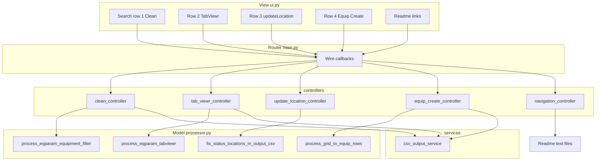

# PLANTSCADA — System overview

This document describes what the application is for and how the codebase is organized so it can grow without turning into a monolith.

## Goals

The project is a **local desktop utility** for working with **SCADA CSV exports** (notably `EQPARAM.csv`-style parameter dumps). The aims are:

1. **Stay lightweight** — Standard library + Tkinter for the UI, Pandas where tabular logic is clearer; no heavy web stack for the core tool.
2. **Keep memory predictable** — The original product vision targets **very large** CSV files; heavy processing should remain stream- or chunk-friendly as features mature (today’s flows load via Pandas but the architecture keeps I/O and logic in the model layer for future optimization).
3. **Separate concerns** — **UI** only collects input and shows status; **routing** only wires events; **controllers** orchestrate a single user action; **services** own reusable side effects (e.g. writing files under `output/`); **processor** owns data rules (filters, TabViewr grid extraction).
4. **Fixed data locations** — Raw files live under `input/`; generated files under `output/` (both typically git-ignored). Paths are not chosen through file dialogs in the first iterations so automation and repeatability stay simple.

## Always-on I/O rule

**Always:** read user and source CSVs from **`input/`** only, and create or overwrite result files in **`output/`** only. The app must **never** write to `input/` (including no saving “fixed” copies there); any use of paths under `input/` is read-only. When adding features, keep this invariant so operators can trust folder roles at a glance.

## What the app does today (functional snapshot)

| Area | Behavior |
|------|------------|
| **Clean** | Reads `input/EQPARAM.csv`, keeps only rows whose `Equipment` column contains the search string (case-insensitive substring), writes all matching columns to `output/cleanEqparam.csv` via the CSV output service (no deduplication). |
| **TabViewr** | Uses a **second** search box on its own row. Filters `input/EQPARAM.csv` by `Equipment`; builds sheets from `Tab_*_Title` / `Status_*_r*c*`; grid cells use `Is Tag`: if true, outputs `Name :: Value ==` resolved text from optional `input/VARIABLE.csv` (`Tag Name` → `Comment`; if VARIABLE is missing or the tag is unknown, resolved is `Value`), else `Name :: Value`; duplicate `(r,c)` joined with `||`. Output CSVs have data rows only (no `c1`/`c2` header). |
| **updateLocation** | Row 3: stem `safety` reads `input/safety.csv`, writes `output/updatesafety.csv` (headerless grid); rewrites `Status_*_r*c*` tokens to match cell positions and may insert `**FAULT**` before `==` when tag/comment pairs do not match `VARIABLE.csv`. |
| **Equip Create** | Row 4: stem `safety` reads **`input/safety.csv`** (headerless grid; read-only), parses TabViewr-style cell text (`Name :: Value` or `Name :: Value == Comment`); splits `||` into multiple output rows; aborts if any cell contains `**FAULT**`. Writes **`output/outputEquipImportsafety.csv`** only. Header line from `input/Eqparam.csv` (or `EQPARAM.csv` for header only). `Cluster`, `Equipment`, and `Project` are empty in generated rows. |
| **Readme** | Row links open help from `controllers/Readme/*.txt` (`clean.txt`, `tabviewr.txt`, `updatelocation.txt`, `equipcreate.txt`). |

## How we develop it (architecture and conventions)

### MVC core

- **`ui.py` (`AppView`)** — View only: Tkinter `grid` layout, callbacks registered by the router, no Pandas, no file path constants.
- **`processor.py`** — Model: Pandas-based transforms, encoding fallbacks for CSV reads, raises `EqparamProcessingError` with clear messages for missing columns or files.
- **`main.py`** — Thin **router**: constructs the view, attaches lambdas that call the right **controller** module. It does not embed business rules.

### Scalable routing (`controllers/`)

Each user-visible action gets its own module:

- `clean_controller.py` — Clean pipeline.
- `tab_viewr_controller.py` — TabViewr export pipeline.
- `update_location_controller.py` — updateLocation grid rewrite.
- `equip_create_controller.py` — Grid → EQPARAM-shaped CSV (`outputEquipImport{stem}.csv`).
- `navigation_controller.py` — Read-only help windows (`open_content` loads text from `controllers/Readme/<name>.txt`).
- `create_controller.py` — Reserved stub until a Create action exists in the UI.

This keeps `main.py` stable when new buttons appear: add a handler import and one `set_on_*` line.

### Services (`services/`)

Cross-cutting **non-UI** operations that might be reused by several controllers:

- **`csv_output_service.py`** — Ensures `output/` exists and writes UTF-8 CSVs from row lists (single place to tighten security rules on filenames later).

### Help and copy (`controllers/Readme/`)

Static text for in-app help lives next to the code that references it (`clean.txt`, `tabviewr.txt`, …) so documentation can be updated without rebuilding binaries.

### UI layout conventions

- **Row numbers** in column 0 (`1`, `2`, `3`, `4`, …) leave room for more toolbar rows later.
- **Shared vs dedicated inputs** — Clean uses the top search field; TabViewr, updateLocation, and Equip Create each use their own row’s entry so values do not overwrite each other.

## High-level flow (diagram)

## How to extend safely

1. Add **UI** controls and `set_on_*` hooks in `AppView`.
2. Register the hook in **`main.py`** pointing to a **new controller** (or an existing one if the action is trivial).
3. Put **data rules** in **`processor.py`** (or a dedicated model module if `processor.py` grows too large).
4. Put **file/network side effects** in **`services/`** and call them from controllers.
5. Add **help text** under `controllers/Readme/` and route through **`navigation_controller.open_content`**.

## Run and dependencies

- Python 3.10+ recommended (type hints, `Path`).
- `pip install -r requirements.txt` (includes Pandas; Tkinter is bundled with Python on Windows).
- Start: `python main.py` from the project root so imports resolve.

---

*This file lives under `UML/` as living documentation; update it when major behaviors or folder conventions change.*
