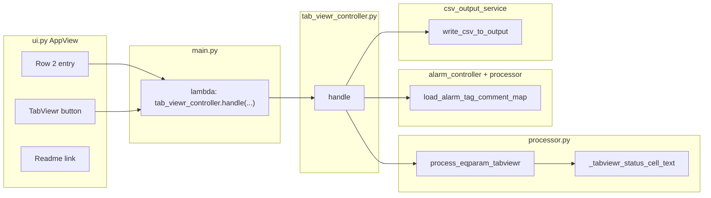

# TabViewr — how it works

This document explains **TabViewr** at a high level and in implementation detail. TabViewr turns a filtered slice of **`input/EQPARAM.csv`** into one or more **two-dimensional “sheet” CSV files** under **`output/`**, where each sheet corresponds to a logical tab/page defined by naming conventions in the EQPARAM export.

---

## High-level summary

1. The operator enters text in **row 2** that must **appear as a substring** in **`Equipment`** (case-insensitive). Rows are **grouped by distinct `Equipment`** so different leaf tags (e.g. `PU4107` vs `PU4107_LT001`) are exported as **separate** files named with each group’s **leaf** slug.
2. The model scans **only those matching rows** and looks for two kinds of **`Name`** column patterns:
   - **`Tab_v{v}_h{h}_Title`** — defines a sheet’s display title and supplies the **title slug** used in the export file name (together with the search text and `v`/`h`).
   - **`Status_v{v}_h{h}_r{row}_c{col}_…`** — defines one **grid cell** at logical coordinates `(row, col)` within sheet `(v, h)`.
3. For each `(v, h)` pair that has **both** at least one title row and at least one status row, the tool builds a **dense rectangle** of cells (from min to max row/column), fills each cell with **encoded text** derived from EQPARAM columns **`Name`**, **`Value`**, **`Is Tag`**, plus optional lookups in **`VARIABLE.csv`** and **`ADVALM.csv`**.
4. The app writes **one UTF-8 CSV per sheet**. Files contain **data rows only** (no header row naming columns `c1`, `c2`, …). Multiple pieces of text targeting the same grid cell are merged with **`||`**.

TabViewr is effectively a **structured projector**: it does not “invent” layout; it **reconstructs grids** from EQPARAM rows that were authored in a Tab/Status naming scheme (typical of SCADA parameter exports).

---

## User-visible workflow

| Step | What happens |
|------|----------------|
| 1 | Place **`EQPARAM.csv`** in **`input/`** (and optionally **`VARIABLE.csv`**, **`ADVALM.csv`**). |
| 2 | In the **second row** (labeled **2**): type text that appears in **`Equipment`** (substring match). |
| 3 | Click **TabViewr**. |
| 4 | Status line shows **Wait…**, then either **Wrote N file(s)** or an error / empty message. |

In-app help text is loaded from **`controllers/Readme/tabviewr.txt`** when the user clicks **Readme** on row 2 (`navigation_controller.handle_tabviewr_readme`).

---

## Architecture (where logic lives)

- **View** (`ui.py`): collects `get_tabviewr_search_string()`, shows status; **no file or pandas logic**.
- **Router** (`main.py`): wires `view.set_on_tabviewr` to `tab_viewr_controller.handle(search, view)`.
- **Controller** (`controllers/tab_viewr_controller.py`): loads alarm map, calls `process_eqparam_tabviewr`, writes each sheet with `write_csv_to_output(..., header=None)`.
- **Model** (`processor.py`): all EQPARAM parsing, filtering, grid assembly, and cell string rules.

---

## Inputs and their roles

### `input/EQPARAM.csv` (required)

A **normal CSV with headers** (not headerless). The pipeline requires these columns, matched **case-insensitively**:

| Column | Role in TabViewr |
|--------|-------------------|
| **Equipment** | Rows kept if **`Equipment`** contains the search text (`_equipment_contains_needle`). TabViewr then **groups** by distinct `Equipment` so each asset leaf gets its own export filenames. |
| **Name** | Discriminates **Tab** vs **Status** rows via regex (see below). |
| **Value** | For Tab rows: sheet title text (slugged for the file name). For Status rows: primary cell payload (tag name or literal). |
| **Is Tag** | For Status rows: if “true-like”, **Value** is resolved through VARIABLE/ADVALM; if false, cell text is simpler `Name :: Value`. |

Encoding: reads try **`utf-8-sig`**, then **`utf-8`**, then **`latin-1`**.

### `input/VARIABLE.csv` (optional)

If present, used when **`Is Tag`** is true for a Status row:

- Must expose **`Tag Name`** or **`Tagname`** (case-insensitive) and **`Comment`**.
- First occurrence of each tag wins.
- If the tag’s **`Value`** is found, cell text uses **`==`** with that comment:  
  `Name :: Value == Comment`.

### `input/ADVALM.csv` (optional)

Loaded via **`alarm_controller.load_alarm_tag_comment_map`** → **`processor.load_alarm_tag_comment_map`**.

- If VARIABLE did not supply a comment for the tag, the code tries **`Alarm Tag`** → **`Comment`**.
- When an alarm comment exists, the separator is **`!!`** (alarm form):  
  `Name :: Value !! Comment`.

If neither VARIABLE nor ADVALM provides a comment for a tag (but **`Is Tag`** is still true and **`Value`** non-empty), the cell falls back to:  
`Name :: Value == Value` (resolved text equals the raw value).

---

## EQPARAM row naming conventions

### Tab title rows

**Primary pattern (regex):** `^Tab_v(\d+)_h(\d+)_Title$` (case-insensitive)

- Captures **sheet indices** `v` and `h`.

**Short pattern:** `^Tab_v(\d+)_Title$` — treated as **`(v, 1)`** when no **`Tab_v{v}_h1_Title`** row exists yet (many exports omit `_h1_`). **`_collect_tab_titles_for_tabviewr`** fills explicit **`Tab_v{v}_h{h}_Title`** first, then applies short names only for missing keys.

- The **`Value`** column becomes the **human title**; it is slugged with **`_slug_filename_component`** for the export filename (see above). If that slug is empty, it defaults to `sheet_v{v}_h{h}`.

CSV reads use **`low_memory=False`** so large EQPARAM files keep consistent columns (avoids pandas chunked inference issues).

### Status rows

**Pattern (regex):** `^Status_v(\d+)_h(\d+)_r(\d+)_c(\d+)_(.+)$` (case-insensitive)

- Captures **`v`**, **`h`**, **`r`**, **`c`**, and a trailing suffix (e.g. `Title`) in **`Name`**.
- Each such row contributes **one logical piece** of text to grid cell **`(r, c)`** for sheet **`(v, h)`**.

---

## How each grid cell’s text is built

Implementation: **`_tabviewr_status_cell_text`** in **`processor.py`**.

Let **`name`** = full **`Name`** field (e.g. `Status_v1_h1_r2_c3_Title`), **`value`** = trimmed **`Value`**.

1. **If `Is Tag` is false**  
   - If either name or value is non-empty: **`name :: value`** (separator is exactly **` :: `**).  
   - Otherwise: empty string.

2. **If `Is Tag` is true**  
   - If **`value`** is empty → empty string.  
   - Else try VARIABLE comment for **`value`** → if found: **`name :: value == comment`**.  
   - Else try ADVALM comment for **`value`** → if found: **`name :: value !! comment`**.  
   - Else: **`name :: value == value`**.

So **`::`** separates name from value; **`==`** marks VARIABLE-style resolution; **`!!`** marks alarm/ADVALM resolution.

---

## From rows to a 2D grid

Inside **`process_eqparam_tabviewr`**:

1. **Filter** EQPARAM by **`Equipment`** substring (`_equipment_contains_needle`), then **group by** distinct **`Equipment`**.
2. **Per group**, **collect titles** `titles[(v,h)]` from Tab rows.
3. **Per group**, **collect cell fragments** in nested maps: for each Status row, append the computed string to **`cell_lists[(v,h)][(r,c)]`** (a **list** per cell).
4. **Per group**, for each `(v,h)` that appears in **`cell_lists`**:
   - **Skip** if there is **no** entry in **`titles`** for that `(v,h)` (sheet must have a Tab title row).
   - Compute the **bounding box** over all `(r,c)` keys that have content.
   - For each **`r`** from min to max and each **`c`** from min to max, output one CSV field:
     - If the list for `(r,c)` is non-empty: join with **`||`**.
     - Else: empty string.

**Duplicate `(r,c)` entries** (multiple EQPARAM rows for the same status cell) therefore appear as **`text1||text2||…`** in a single CSV cell.

5. **Output filename stem**: **`leafSlug_v{v}_h{h}_titleSlug`** where **`leafSlug`** comes from the **Equipment leaf** of that row group (not the search box), built by **`_truncate_tabviewr_export_stem`** (max length **`_TABVIEWR_OUTPUT_STEM_MAX_LEN`**, default 120). If two stems still collide after truncation, a numeric suffix **`_2`**, **`_3`**, … is appended within the same length budget.

---

## Output files

- **Directory:** **`output/`** (created if needed).
- **Format:** UTF-8 CSV via **`csv.writer`**, **no header row** (`header=None` in **`write_csv_to_output`**).
- **Shape:** Each row of the file is a **row of the grid**; each column is a **column of the grid**. The first physical CSV row corresponds to the **minimum** `r` index present, and so on.

---

## Status messages and errors

| Situation | User-visible status |
|-----------|---------------------|
| Empty search | **Enter a search tag** (controller short-circuits before the model). |
| Model: empty needle | **`EqparamProcessingError`**: *Search text is empty.* |
| Missing `EQPARAM.csv` | *Missing file: …* |
| Missing required column | *Missing required column "…"* |
| No equipment matches or no Tab/Status sheets | **No Tab/Status sheets to export** |
| Success | **Wrote N file(s)** |

The controller also **`print`**s a short log line on success or **`EqparamProcessingError`**.

---

## Relationship to other features

- **Clean** uses the same **`Equipment`** **contains** rule but outputs a **flat** filtered EQPARAM table (`process_eqparam_equipment_filter`), not grids.
- **Equip Create** reads a **headerless** grid CSV and **parses** TabViewr-style cell strings **back** into EQPARAM-shaped rows (`_parse_tabviewr_fragment_to_fields`, **` :: `** delimiter). That pipeline is the **inverse** of TabViewr’s cell encoding for import workflows.
- **updateLocation** rewrites **`Status_*`** tokens inside grid CSVs and may inject **`**FAULT**`** when tag/comment pairs disagree with VARIABLE; TabViewr itself does **not** emit **`**FAULT**`** in cells.

---

## Quick reference (constants)

| Constant | Value | Meaning |
|----------|--------|---------|
| `_TABVIEWR_OUTPUT_STEM_MAX_LEN` | `120` | Max characters for TabViewr export filename stem |
| `_TABVIEWR_SEP` | ` :: ` | Between **Name** and **Value** display in cells |
| `_TAG_VALUE_SEP` | ` == ` | VARIABLE resolution |
| `_TAG_ALARM_SEP` | ` !! ` | ADVALM / alarm resolution |

---

## Code map

| Artifact | Path / symbol |
|----------|----------------|
| UI row 2 | `ui.py` — `_tabviewr_entry`, `_tabviewr_btn`, `get_tabviewr_search_string`, `set_on_tabviewr` |
| Router | `main.py` — `set_on_tabviewr`, `set_on_tabviewr_readme_click` |
| Controller | `controllers/tab_viewr_controller.py` — `handle` |
| Alarm preload | `controllers/alarm_controller.py` — `load_alarm_tag_comment_map` |
| Core algorithm | `processor.py` — `process_eqparam_tabviewr`, `_collect_tab_titles_for_tabviewr`, `_tabviewr_status_cell_text`, `_equipment_contains_needle`, `_equipment_leaf_segment`, `_slug_filename_component`, `_truncate_tabviewr_export_stem` |
| Regexes | `processor.py` — `_TAB_TITLE_RE`, `_TAB_TITLE_SHORT_RE`, `_STATUS_CELL_RE` |
| Write files | `services/csv_output_service.py` — `write_csv_to_output` |
| Help text | `controllers/Readme/tabviewr.txt` |

---

## Design intent (why it looks like this)

SCADA exports often express **UI pages** as flat parameter rows: one row per widget or binding, with names like **`Tab_*_Title`** and **`Status_*_r*c*`**. TabViewr **re-hydrates** that representation into **grids** operators can open in Excel or feed into **Equip Create**, without loading a proprietary SCADA editor. Keeping **`input/`** read-only and **`output/`** write-only preserves a clear audit boundary for processed artifacts.
